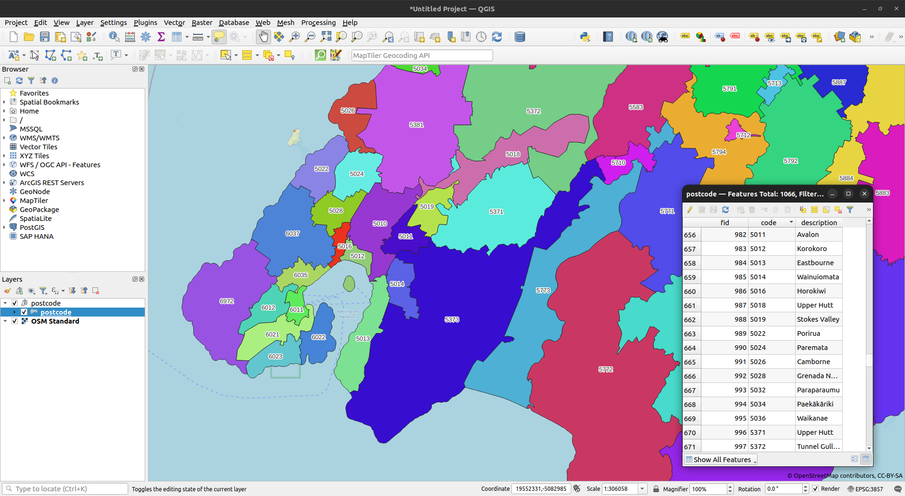
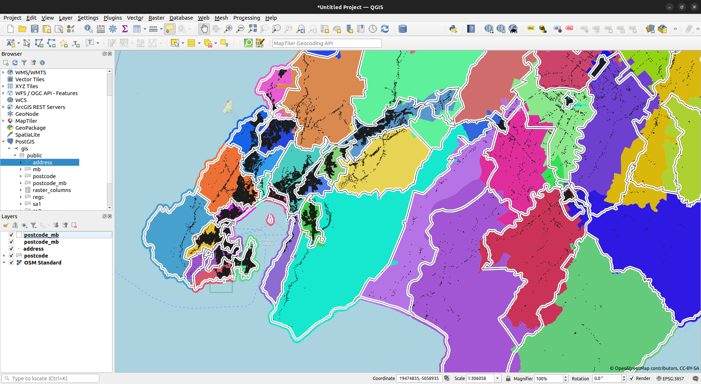
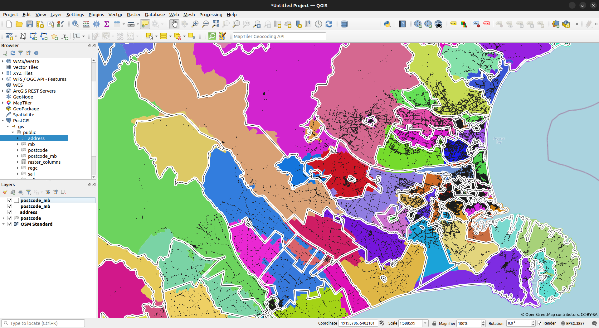

# Create a New Zealand Postcode Feature Class

This repo primarily contains a simple R script, `nz_postcode_wpc.R`, which fetches the postcode information for New Zealand from the [Worldpostalcodes](https://www.worldpostalcodes.org/) website.  For convenience, and for non-R programmers, the code can be run using Docker Compose:

```bash
mkdir -p data
docker compose -f postcodegpkg.yml up -d
```

When complete, and if all has gone well, a single geopackage will be output in `data/postcode.gpkg`.



## Extensions

There are a number of interesting things we can do once we have postcodes in a single feature class, and the repo contains code for a couple of scenarios:

* attach postcode to [LINZ street addresses](https://data.linz.govt.nz/layer/53353-nz-street-address/)
* create a approximation of postcode made of [meshblocks](https://datafinder.stats.govt.nz/layer/106723-meshblock-2022-clipped-generalised/)

### PostGIS!

Interesting things will often require us to conduct a spatial join.  A good way of doing this is to load feature classes to a PostGIS-enabled database, and then use spatial queries.  We can get a usable database using Docker easily enough, and a sufficient instance is provided here.  Simply run:

```bash
docker compose -f postgis.yml up -d
```

This will result in a docker image called `postgis` being created, and an instance created.  Data loaded to the instance will be persisted in a volume called `postgisdata`, so we need only load it once.  Assuming we have all the required data saved in the folder `data` ahead of time, this can be done by running:

```r
library(sf)
library(dplyr)

# postcode ---------------------------------------------------------------------
postcode <- st_read("data/postcode.gpkg") |>
  st_transform(2193)

# meshblock --------------------------------------------------------------------
mb <- st_read("data/meshblock-2022-clipped-generalised.gpkg") |>
  st_transform(2193) |>
  rename(code = MB2022_V1_00) |>
  select(code)

# address ----------------------------------------------------------------------
addr <- st_read("data/nz-street-address.gpkg") |>
  st_transform(2193)

colnames(addr) <- tolower(colnames(addr))

# load to postgis --------------------------------------------------------------
conn <- RPostgreSQL::dbConnect(
  "PostgreSQL", host = "localhost", port = 5432,
  dbname = "gis", user = "gisuser", password = "gisuser"
)

st_write(postcode, conn, c("public", "postcode"))
st_write(mb, conn, c("public", "mb"))
st_write(addr, conn, c("public", "address"))

DBI::dbSendQuery(
  conn,
  '
  CREATE INDEX postcode_idx
  ON postcode
  USING GIST (geom);
  '
)

DBI::dbSendQuery(
  conn,
  '
  CREATE INDEX mb_idx
  ON mb
  USING GIST (geom);
  '
)

DBI::dbSendQuery(
  conn,
  '
  CREATE INDEX addr_idx
  ON address
  USING GIST (geom);
  '
)

# tidy up ----------------------------------------------------------------------
DBI::dbDisconnect(conn)
rm(list = ls())
```

## Attach postcode to LINZ addresses

This is quite straightforward.  Simply run the following query:

```sql
select
  a.address_id, b.code as postcode
from
  address a
left outer join
  postcode b
on
  ST_CONTAINS(b.geom, a.geom)
```

On the author's machine, this query ran in 39 seconds (noting the number of addresses at the time this was posted was 2156916).  Given a database connection, `conn`, we can fetch this as a spatial object in R by running:

```r
addr_w_postcode <- sf::st_read(
  conn,
  query = "
  select
    a.*, b.code as postcode, b.description as postcode_name
  from
    address a
  left outer join
    postcode b
  on
    ST_CONTAINS(b.geom, a.geom)
  "
)
```

# Approximating postcode with meshblocks

Postcodes were created by NZ Post, to satisfy their own business requirements.  An interesting idea is to create something like postcode by aggregating existing standard geographic units in an attempt to make something a little more consistent (better consistency would be achieved, of course, if this was done without letting postcodes span more than a single territorial authority).  

Either way, We can do this by first intersecting the postcode and meshblock layers.  Assuming again we have a database connection, `conn`, this can be done all in R as follows:

```r
# intersect mb and postcode
mb_int_postcode <- st_read(
  conn,
  query = "
  select
    a.code as mb,
    b.code as postcode,
    ST_INTERSECTION(a.geom, st_makevalid(b.geom)) as geom
  from
    mb a
  inner join
    postcode b
  on
    ST_INTERSECTS(a.geom, st_makevalid(b.geom))
  "
)

# just keep the mb / postcode pair with the largest area grpuped by postcode
# this is the concordance
mbpostcode <- mb_int_postcode |>
  mutate(area = st_area(geom)) |>
  arrange(mb, desc(area)) |>
  group_by(mb) |>
  filter(row_number() == 1) |>
  select(-area) |>
  ungroup() |>
  st_drop_geometry() |>
  as.data.frame()

# add concordance to mb, then dissolve postcode
postcode_mb <- mb |>
  inner_join(mbpostcode, by = c("code" = "mb")) |>
  group_by(postcode) |> summarise(num_mb = n())

st_write(postcode_mb, conn, c("public", "postcode_mb"))

DBI::dbSendQuery(
  conn,
  '
  CREATE INDEX postcodemb_idx
  ON postcode_mb
  USING GIST (geom);
  '
)
```

We can't expect perfect agreement, of course, but the results are nevertheless reasonable (and more than 99% of LINZ addresses are placed in the correct postcode using this method).



